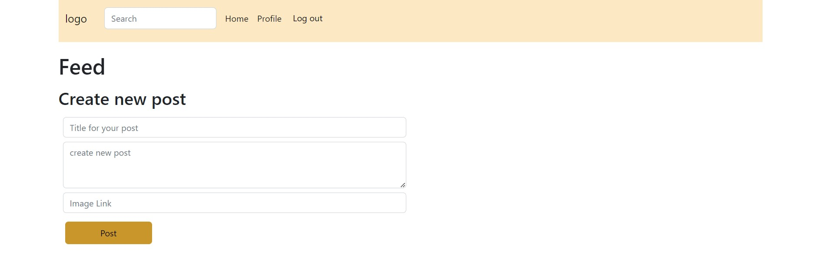

# CA2-FED2 - Social Media Client

  
[Visit deployed site here](https://socialmedia-main-head.netlify.app "SNS homepage") 

---

# Usage

You need to log in to view the content of the main page.  
You can either register a new account. (Just create any made-up email address that ends with *@noroff.no or *@stud.noroff.no)

or borrow this login:

**Email:** bubba@noroff.no  
**Password:** 12345678

---

# Process and results

!
*During the weekend/monday some changes were made to the API that caused the media tags to be null instead of "", so I changed it last minute. The changes to the API were fixed again after delivery deadline so I re-did the changes and made a commit after delivery deadline because of this.*

I consider this project unfinished since there is a lot I would like to change and add but couldn't because I've been very busy the past two weeks.

At least I managed to implement all required functionality, but some features I would like to add/change would be:  

* Add delete/edit buttons to the post when they show up in the feed, not only on "view post" page.  
* The styling for the "edit" link should be improved as it is not very noticable as it currently is.  
* The "edit" button was working perfectly some time earlier, but during last testing there seems to be some issues with it where it works sometimes but not always. Did not have time to figure this out.  
* "like" and "comment" buttons does not work. I would've liked to implement this functionality as well. And the option to change profile picture.  

**Modules:**  
I had planned on cleaning up the code and organizing some of the js code using modules, however I ran out of time.  
There might be unused code that is commented out left in the files, I was going to clean this up but didn't have time.  
Some of the functions I would've liked to use as modules:  
get the posts and list them out. To do this I would've tried to add a third parameter that could be used to alter the method; "POST", "PUT", "DELETE", "GET".  

**Styling:**  
There is **a lot** of missing styling that I would want to add. Some of it being:

* Making the nav-bar more appealing by placing "home", "profile" and "log out" to the far right, as well as adding a small profile image next to "profile".  
* Colors could be improved.  
* The content of the listed posts have a orange underline that should've been removed.  
* The "create new post" form should've been more "whole" instead of 3 seperate input fields.  
* In the validation for login and register the error messages should be colored red. 
* At login page the login-error message appears down in the bottom corner. It should be more visible and placed in the center.

---

# Assignment

Create a website for a social media client.  
You should be logged-in in order to view content and interact with the site.  
Register user-form and login-form with Js validation should be included.  
Get posts from the noroff API and use endpoints to create your own posts that you can edit/delete.  

---

# Sources:

All RegEx er tatt fra:
https://code.tutsplus.com/tutorials/8-regular-expressions-you-should-know--net-6149

Picture for default user img was taken straight from google... I only did this as a quick temporary solution and forgot to change it later. I didn't even save the link where I found the image. This is a big no-no, but I hope I can be forgiven this one time.
